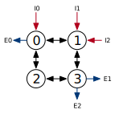

Routing Configuration
=================================
In Constellation, the desired routing relation is specified by the user as an
abstract Scala function, instead of an RTL implementation of a routing table.
Constellation will use this function to "compile" a hardware implementation
of the desired routing algorithm.

.. literalinclude:: ../../../src/main/scala/routing/RoutingRelations.scala
   :language: scala
   :start-after: BEGIN: RoutingRelation
   :end-before: END: RoutingRelation

Channel Identifier
----------------------
The ``ChannelRoutingInfo`` case class uniquely identifies a virtual channel,
ingress channel, or egress channel in the system.

.. literalinclude:: ../../../src/main/scala/routing/Types.scala
   :language: scala
   :start-after: BEGIN: ChannelRoutingInfo
   :end-before: END: ChannelRoutingInfo

The fields of this case class are:

 - ``src`` is the source physical node of the channel. If this is an ingress channel,
   this value is -1.
 - ``dst`` is the destination physical node of the channel. If this is an egress channel,
   this value is -1.
 - ``vc`` is the virtual channel index within the channel.
 - ``n_vc`` is the number of available virtual channels in this physical channel.

Consider a toy network depicted below with bidirectional physical channels, and two
virtual channels on each physical channel. The list of all possible ``ChannelRoutingInfo``
in this network is shown

+-------------------------------------------------------------------------+--------------------+
| .. code:: scala                                                         | |terminals|        |
|                                                                         |                    |
|    // Ingresses                                                         |                    |
|    ChannelRoutingInfo(src=-1, dst=0, vc=0, n_vc=1)                      |                    |
|    ChannelRoutingInfo(src=-1, dst=1, vc=0, n_vc=1)                      |                    |
|                                                                         |                    |
|    // Egresses                                                          |                    |
|    ChannelRoutingInfo(src=0, dst=0, vc=0, n_vc=1)                       |                    |
|    ChannelRoutingInfo(src=0, dst=3, vc=0, n_vc=1)                       |                    |
|                                                                         |                    |
|    // Routing channels                                                  |                    |
|    ChannelRoutingInfo(src=0, dst=1, vc=0, n_vc=2)                       |                    |
|    ChannelRoutingInfo(src=0, dst=1, vc=1, n_vc=2)                       |                    |
|    ChannelRoutingInfo(src=1, dst=0, vc=0, n_vc=2)                       |                    |
|    ChannelRoutingInfo(src=1, dst=0, vc=1, n_vc=2)                       |                    |
|    ...                                                                  |                    |
|                                                                         |                    |
+-------------------------------------------------------------------------+--------------------+

.. Note:: In the current implementations, packets arriving at the egress physical node are
          always directed to the egress. Thus, ``ChannelRoutingInfo`` for the egress channels are
          not used. Additionally, this limitation prevents the implementation of deflection
          routing algorithms

Flow Identifier
----------------
The ``FlowRoutingInfo`` case class uniquely identifies a potential flow, or packet
that might traverse the NoC.

.. literalinclude:: ../../../src/main/scala/routing/Types.scala
   :language: scala
   :start-after: BEGIN: FlowRoutingInfo
   :end-before: END: FlowRoutingInfo

The fields of this case class are:

 - ``ingressId`` is the ingress index of the flow.
 - ``ingressNode`` is the physical node of the ingress of this flow.
 - ``ingressNodeId`` is the index of the ingress within all ingresses at the physical node.
 - ``egressId`` is the egress index of the flow
 - ``egressNode`` is the physical node of the egress of this flow
 - ``egressNodeId`` is the physical node of the egress within all egresses at the physical node
 - ``vNetId`` is the virtual subnetwork identifier of this flow

As an example, consider the same topology with two virtual subnetworks, for odd and even ingress
and egresses.
   
+-------------------------------------------------------------------------+--------------------+
| .. code:: scala                                                         | |terminals|        |
|                                                                         |                    |
|                             egressId                                    |                    |
|              ingressNodeId  |  egressNode                               |                    |
|             ingressNode  |  |  |  egressNodeId                          |                    |
|            ingressId  |  |  |  |  |  vNetId                             |                    |
|                    |  |  |  |  |  |  |                                  |                    |
|    FlowRoutingInfo(0, 0, 0, 0, 0, 0, 0)                                 |                    |
|    FlowRoutingInfo(0, 0, 0, 2, 3, 1, 0)                                 |                    |
|    FlowRoutingInfo(0, 0, 0, 2, 3, 1, 0)                                 |                    |
|    FlowRoutingInfo(2, 1, 1, 0, 0, 0, 0)                                 |                    |
|    FlowRoutingInfo(2, 1, 1, 2, 3, 1, 0)                                 |                    |
|    FlowRoutingInfo(2, 1, 1, 2, 3, 1, 0)                                 |                    |
|                                                                         |                    |
|    FlowRoutingInfo(1, 1, 1, 1, 3, 1, 1)                                 |                    |
|    FlowRoutingInfo(1, 1, 1, 1, 3, 1, 1)                                 |                    |
|    FlowRoutingInfo(1, 1, 1, 1, 3, 1, 1)                                 |                    |
|                                                                         |                    |
+-------------------------------------------------------------------------+--------------------+

Base Routing Relations
-----------------------

Numerous builtin routing relations are provided. These provide deadlock-free routing
for the included topology generators.

+--------------------------------------------------+-------------------------------------------------------+
| RoutingRelation                                  | Description                                           |
+==================================================+=======================================================+
| ``AllLegalRouting``                              | Allows any packet to transition to any VC. Only       |
|                                                  | useful for trivial networks                           |
+--------------------------------------------------+-------------------------------------------------------+
| ``UnidirectionalLineRouting``                    | Routing for a ``UnidirectionalLine`` topology.        |
+--------------------------------------------------+-------------------------------------------------------+
| ``BidirectionalLineRouting``                     | Routing for a ``BidirectionalLine`` topology.         |
+--------------------------------------------------+-------------------------------------------------------+
| ``UnidirectionalTorus1DDatelineRouting``         | Routing for a ``UnidirectionalTorus1D`` topology.     |
|                                                  | Uses a dateline to avoid deadlock. Requires at least  |
|                                                  | 2 VCs per physical channel                            |
+--------------------------------------------------+-------------------------------------------------------+
| ``BidirectionalTorus1DRandomRouting``            | Routing for a ``BidirectionalTorus1D`` topology. Uses |
|                                                  | a dateline to avoid deadlock. Packets randomly choose |
|                                                  | a direction at ingress. Requires at least 2 VCs per   |
|                                                  | physical channel                                      |
+--------------------------------------------------+-------------------------------------------------------+
| ``BidirectionalTorus1DShortestRouting``          | Routing for a ``BidirectionalTorus1D`` topology. Uses |
|                                                  | a dateline to avoid deadlock. Packets choose          |
|                                                  | direction at ingress which minimizes hops. Requires   |
|                                                  | at least 2 VCs per physical channel.                  |
+--------------------------------------------------+-------------------------------------------------------+
| ``ButterflyRouting``                             | Routing for a ``Butterfly`` topology with arbitrary   |
|                                                  | ``kAry`` and ``nFly``.                                |
+--------------------------------------------------+-------------------------------------------------------+
| ``BidirectionalTreeRouting``                     | Routing for a ``BidirectionalTree`` topology.         |
+--------------------------------------------------+-------------------------------------------------------+
| ``Mesh2DDimensionOrderedRouting``                | Routing for a ``Mesh2D`` topology. Routes in one      |
|                                                  | dimension first, than the other to prevent deadlock   |
+--------------------------------------------------+-------------------------------------------------------+
| ``Mesh2DWestFirstRouting``                       | Routing for a ``Mesh2D`` topology. Routes in the      |
|                                                  | westward dimension first to prevent deadlock          |
+--------------------------------------------------+-------------------------------------------------------+
| ``MEsh2DNorthLastRouting``                       | Routing for a ``Mesh2D`` topology. Routes in the      |
|                                                  | northward dimension last to prevent deadlock.         |
+--------------------------------------------------+-------------------------------------------------------+
| ``Mesh2DEscapeRouting``                          | Escape-channel based adaptive minimal routing for     |
|                                                  | ``Mesh2D`` topology. Escape channel routes using      |
|                                                  | dimension ordered routing, while other channels route |
|                                                  | any minimal path.                                     |
+--------------------------------------------------+-------------------------------------------------------+
| ``DimensionOrderedUnidirectionalTorus2DRouting`` | Routing for the ``UnidirectionalTorus2D`` topology.   |
|                                                  | Routes in the X dimension first.                      |
+--------------------------------------------------+-------------------------------------------------------+
| ``DimensionOrderedBidirectionalTorus2DRouting``  | Routing for the ``BidirectioanlTorus2D`` topology.    |
|                                                  | Routes in the X dimension first.                      |
+--------------------------------------------------+-------------------------------------------------------+

Compositional Routing Relations
-------------------------------

Several compositional routing relation classes are provided.

Escape Channel Routing
^^^^^^^^^^^^^^^^^^^^^^
Escape-channel based routing can be used to build deadlock-free adaptive routing policies. When the routing
policy on the escape virtual channels is deadlock-free, and packets in the escape channels cannot route on the
non-escape virtual channels, the resulting policy is deadlock-free, even if circular dependencies exist among the
non-escape virtual channels.

The ``EscapeChannelRouting`` class has three parameters:

 - ``escapeRouter``: the base deadlock-free routing algorithm that will be used on the escape VCs.
 - ``normalRouter``: the routing algorithm for all non-escape VCs.
 - ``nEscapeChannels``: the number of VCs to dedicate for escape channels on each physical channel

For example, a ``Mesh2DEscapeRouting`` algorithm with two escape channels using dimension-orderd routing
can be described as:

.. code:: scala

          EscapeChannelRouting(
            escapeRouter    = Mesh2DDimensionOrderedRouting(),
            normalRouter    = Mesh2DMinimalRouting(),
            nEscapeChannels = 2
          )

Terminal Router Routing
^^^^^^^^^^^^^^^^^^^^^^^
``TerminalRouter`` topologies require the ``TerminalRouterRouting`` routing relation.
The ``baseRouting`` field is the base routing relation used to route among the non-terminal
routers in the topology.

.. |topo_term| image:: ../diagrams/topo_term.svg
   :width: 200px

+-------------------------------------------------------------------+--------------------+
| | ``topolog = TerminalRouter(BidirectionalLine(4))``              | |topo_term|        |
| | ``routing = TerminalRouterRouting(BidirectionalLineRouting())`` |                    |
+-------------------------------------------------------------------+--------------------+

Hierarchical Topology Routing
^^^^^^^^^^^^^^^^^^^^^^^^^^^^^
``Hierarchical`` toplogies require the ``HierarchicalRouting`` routing relation.
The ``baseRouting`` field is the routing relation for the base topology, while the
``childRouting`` field is alist of routing relations for the sub-topologies.

Hierarchical routing can be composed with terminal router routing.

.. |topo_hier| image:: ../diagrams/topo_hier.svg
   :width: 250px

.. |topo_hierterm| image:: ../diagrams/topo_hierterm.svg
   :width: 250px

+-------------------------------------------------------------------------+--------------------+
| .. code:: scala                                                         | |topo_hier|        |
|                                                                         |                    |
|    topology = HierarchicalTopology(                                     |                    |
|      base = UnidirectionalTorus1D(4),                                   |                    |
|      children = Seq(                                                    |                    |
|        HierarchicalSubTopology(0,2,BidirectionalLine(5)),               |                    |
|        HierarchicalSubTopology(2,1,BidirectionalLine(3))                |                    |
|      )                                                                  |                    |
|    )                                                                    |                    |
|    routing = HierarchicalRouting(                                       |                    |
|      baseRouting = UnidirectionalTorus1DDatelineRouting(),              |                    |
|      childRouting = Seq(                                                |                    |
|        BidirectionalLineRouting(),                                      |                    |
|        BidirectionalLineRouting()                                       |                    |
|      )                                                                  |                    |
|    )                                                                    |                    |
+-------------------------------------------------------------------------+--------------------+
| .. code:: scala                                                         | |topo_hierterm|    |
|                                                                         |                    |
|    topology = TerminalRouter(HierarchicalTopology(                      |                    |
|      base = UnidirectionalTorus1D(4),                                   |                    |
|      children = Seq(                                                    |                    |
|        HierarchicalSubTopology(0,2,BidirectionalLine(5)),               |                    |
|        HierarchicalSubTopology(2,1,BidirectionalLine(3))                |                    |
|      )                                                                  |                    |
|    ))                                                                   |                    |
|    routing = TerminalRouter(HierarchicalRouting(                        |                    |
|      baseRouting = UnidirectionalTorus1DDatelineRouting(),              |                    |
|      childRouting = Seq(                                                |                    |
|        BidirectionalLineRouting(),                                      |                    |
|        BidirectionalLineRouting()                                       |                    |
|      )                                                                  |                    |
|    )                                                                    |                    |
+-------------------------------------------------------------------------+--------------------+

Virtual Subnetwork Routing Relations
--------------------------------------

A special class of compositional routing relations can enforce forwards progress on networks
with multiple virtual subnetworks.

 - The ``NonblockingVirtualSubnetworksRouting`` policy guarantees all virtual subnetworks on the network
   can always make forwards progress by dedicating some number of virtual channels to each subnetwork.
 - The ``BlockingVirtualSubnetworksRouting`` policy guarantees that lower-indexed virtual subnetworks
   can always make forwards progress while higher-indexed virtual subnetworks are blocked.
