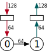

Terminals
----------------

Constellation decouples the parameterization of ingress and egress channels from the base routing
topology to allow for more flexibility in the described networks. Any router in the network can
support many or no ingress and egress channels. The ``UserIngressParams`` and ``UserEgressParams``
case classes specify where the ingress and egress terminals are.

.. |terminals| image:: ../diagrams/terminals.svg
   :width: 300px

+-------------------------------------------------------------------------+--------------------+
| .. code:: scala                                                         | |terminals|        |
|                                                                         |                    |
|    ingresses=Seq(UserIngressParams(0),                                  |                    |
|                  UserIngressParams(1),                                  |                    |
|                  UserIngressParams(1)),                                 |                    |
|    egresses=Seq(UserEgressParams(0),                                    |                    |
|                 UserEgressParams(3),                                    |                    |
|                 UserEgressParams(3))                                    |                    |
|                                                                         |                    |
+-------------------------------------------------------------------------+--------------------+

Explicit payload widths should also be specified. Usually, the payload width specified here would
match the payload width of the router the terminal connects to.

If the terminal payload width is a multiple or factor of the router payload width, Constellation
will auto-generate width converters to either further segment or merge flits.

+-------------------------------------------------------------------------+--------------------+
| .. code:: scala                                                         | |terminal_width|   |
|                                                                         |                    |
|    ingresses = Seq(UserIngressParams(0), payloadBits=128)),             |                    |
|    egresses  = Seq( UserEgressParams(0), payloadBits=128)),             |                    |
|    routers   = (i) => UserRouterParams(payloadBits=64),                 |                    |
|                                                                         |                    |
+-------------------------------------------------------------------------+--------------------+

.. Note:: The common use case for ``payloadWidth`` is to set the same width for all terminals.

.. Warning:: Be wary of using payload width converters liberally. For example, a 3-flit packet of
	     64 bits per flit, if up-scaled to a 2-flit packet of 128 bits per flit, will be
	     down-scaled into a 4-flit packet of 64 bits per flit.
