Topology
----------------------

A ``PhysicalTopology`` is a case class which describes a directed graph, where nodes represent
routers, and edges represent unidirectional channels. 

.. literalinclude:: ../../../src/main/scala/topology/Topologies.scala
   :language: scala
   :start-after: BEGIN: PhysicalTopology
   :end-before: END: PhysicalTopology

To see how to extend his trait, consider the ``UnidirectionalTorus1D`` topology.

.. literalinclude:: ../../../src/main/scala/topology/Topologies.scala
   :language: scala
   :start-after: BEGIN: UnidirectionalTorus1D
   :end-before: END: UnidirectionalTorus1D

The current list of included base topologies is described below. User can always define
their own topology.

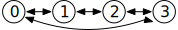

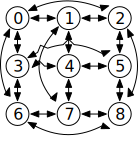

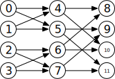

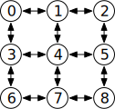

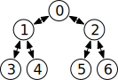

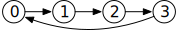

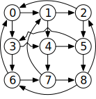

+---------------------------+----------------------------------+--------------------+
| Topology                  | Parameters                       | Diagram            |
+===========================+==================================+====================+
| ``UnidirectionalLine``    | ``nNodes``: Number of nodes      | |topo_uniline|     |
+---------------------------+----------------------------------+--------------------+
| ``BidirectionalLine``     | ``nNodes``: Number of nodes      | |topo_biline|      |
+---------------------------+----------------------------------+--------------------+
| ``UnidirectionalTorus1D`` | ``nNodes``: Number of nodes      | |topo_unitorus1d|  |
+---------------------------+----------------------------------+--------------------+
| ``BidirectionalTorus1D``  | ``nNodes``: Number of nodes      | |topo_bitorus1d|   |
+---------------------------+----------------------------------+--------------------+
| ``Butterfly``             | | ``kAry``: Degree of routers    | |topo_butterfly|   |
|                           | | ``nFly``: Number of stages     |                    |
+---------------------------+----------------------------------+--------------------+
| ``BidirectionalTree``     | | ``height``: Height of tree     | |topo_tree|        |
|                           | | ``dAry``  : Degree of routers  |                    |
+---------------------------+----------------------------------+--------------------+
| ``Mesh2D``                | | ``nX``: Extent in X-dimension  | |topo_mesh|        |
|                           | | ``nY``: Extent in Y-dimension  |                    |
+---------------------------+----------------------------------+--------------------+
| ``UnidirectionalTorus2D`` | | ``nX``: Extent in X-dimension  | |topo_unitorus2d|  |
|                           | | ``nY``: Extent in Y-dimension  |                    |
+---------------------------+----------------------------------+--------------------+
| ``BidirectionalTorus2D``  | | ``nX``: Extent in X-dimension  | |topo_bitorus2d|   |
|                           | | ``nY``: Extent in Y-dimension  |                    |
+---------------------------+----------------------------------+--------------------+

Additionally, two hierarchical compositional topology generators are provided:
``TerminalRouter`` and ``HierarchicalTopology``.

Terminal Router Topologies
^^^^^^^^^^^^^^^^^^^^^^^^^^

The ``TerminalRouter`` topology class "wraps" a base topology with a layer of
terminal router nodes, which the ingresses and egresses tie to. This reduces the
radix of critical routers in the network. This topology class can wrap an
arbitrary base topology (including custom topologies).

For example, consider a network where the base topology is a bidirectional line.
Wrapping the base ``BidirectionalLine`` topology class in the ``TerminalRouter``
class "lifts" the terminal points into separate nodes (purple), while preserving
the existing topology and routing behavior on the underlying network routers.

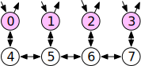

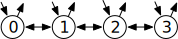

+------------------------------------------+--------------------+
| Topology                                 | Diagram            |
+==========================================+====================+
| ``BidirectionalLine(4)``                 | |topo_noterm|      |
+------------------------------------------+--------------------+
| ``TerminalRouter(BidirectionalLine(4))`` | |topo_term|        |
+------------------------------------------+--------------------+

.. Note:: The ``TerminalRouter`` topology must be used with the ``TerminalRouting`` routing
	  relation wrapper

Hierarchical Topologies
^^^^^^^^^^^^^^^^^^^^^^^^

The ``HierarchicalTopology`` class joins a collection of child sub-topologies using
a base topology. A ``HierarchicalSubTopology`` describes a child sub-topology, as well as
the connection to the base topology.

In the first example below, note how the first hierarchical child topology describes a
channel between the 0th node on the base topology, and what would be node 2 on the
child topology. Here the green nodes are from the base topology, while the blue nodes
are from the child topologies.

.. Note:: The ``TerminalRouter`` can be combined with ``HierarchicalTopology``, as shown
	  in the second example

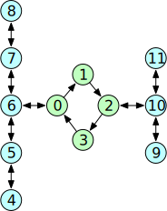

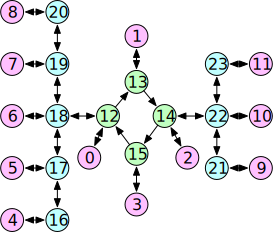

+-------------------------------------------------------------------------+--------------------+
| Topology                                                                | Diagram            |
+=========================================================================+====================+
| .. code:: scala                                                         | |topo_hier|        |
|                                                                         |                    |
|    HierarchicalTopology(                                                |                    |
|      base=UnidirectionalTorus1D(4),                                     |                    |
|      children=Seq(                                                      |                    |
|        HierarchicalSubTopology(0,2,BidirectionalLine(5)),               |                    |
|        HierarchicalSubTopology(2,1,BidirectionalLine(3))                |                    |
|      )                                                                  |                    |
|    )                                                                    |                    |
+-------------------------------------------------------------------------+--------------------+
| .. code:: scala                                                         | |topo_hierterm|    |
|                                                                         |                    |
|    TerminalRouter(HierarchicalTopology(                                 |                    |
|      base=UnidirectionalTorus1D(4),                                     |                    |
|      children=Seq(                                                      |                    |
|        HierarchicalSubTopology(0,2,BidirectionalLine(5)),               |                    |
|        HierarchicalSubTopology(2,1,BidirectionalLine(3))                |                    |
|      )                                                                  |                    |
|    ))                                                                   |                    |
+-------------------------------------------------------------------------+--------------------+

.. Note:: The ``HierarchicalTopology`` topology must be used with the ``HierarchicalRouting``
	  routing relation wrapper

