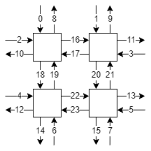
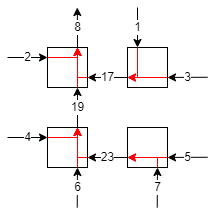

# Verification

## Usage

```
usage: verify.py [-h] [-a] [-b] [-c C] [-d] graph [graph ...]

positional arguments:
  graph

optional arguments:
  -h, --help  show this help message and exit
  -a          prove liveness property for each graph
  -b          prove deadlock-free property by searching a loop
  -c C        prove deadlock-free property by verifying the given escape channels
  -d          prove deadlock-free property by searching a valid subrelation
```

## Channel dependence graph

Each channel is given an interger id starting from 0. The format of the file is as follows:

```
#channels
input channel ids separated by space
output channel ids separated by space
sender receiver [receiver ...]
...
```

### Example
The "xy_routing" directory contains a channel dependence graph of xy routing for each output channel for the following architecture:




For example, if the channel 8 is the output, the communication can happen among the channels as shown in the following figure:



As written in the "xy_routing/out8.txt", the channel dependence graph for this case can be expressed as follows:

```
24
1 2 3 4 5 6 7
8
1 17
2 8
3 17
4 19
5 23
6 19
7 23
17 8
19 8
23 19
```

## Liveness property

A liveness property is a property that a packet will eventually reach one of the outputs. This property is checked for each of the given graphs. An SMT problem is created to find a path from one of the inputs to a loop or a non-output terminal. If the problem is unsatisfiable, this property is proven. Otherwise, the program shows a set of channels that comprise such a path that violates the property. Note that currently this set may include other channels that do not belong to the problematic path. We could exclude them through iterative solving but not yet implemented.

### Example

under construction

## Deadlock-free property

A deadlock-free property is a property that a deadlock never happens among multiple packets. We assume each packet can occupy multiple channels at the same time. This property is checked using all of the given graphs, as each packet may have a different destination. Three methods are implemented to prove this property.

The first method simply searches a loop in the union of the given graphs, where the channel dependences in all given graphs are accumulated. As all channels may be occupied by packets each heading for a different destination simultaneously, a loop in the union of the dependence grpahs could cause a deadlock. If there does not exist a loop, the routing is proven to be deadlock-free. Otherwise, the program returns a set of channels that form a loop. However, even if a loop exists, the routing could be deadlock-free because of escape channels.

The second and third methods prove the deadlock-free property under escape channels. The second method takes as input a file in which the escape channels are written separated by space. It proves that there does not exists a loop in an extended channel dependence graph, which consists of the direct dependences (dependences among the escape channels) and the indirect dependences (dependences via non-escape channels). An indirect dependence exists between the escape channels when there exists a sequence of dependence between them in at least one of the dependecne graphs, which may include non-escape channels. It is assumed that the given escape channels connect all sources and destinations.

The third problem tries to synthesize a valid set of escape channels. It iteratively generates a tentative solution that satisfies a connectivity condition and verifies it by the same problem as the second method. If it is not valid, we obtain a set of escape channels that form a loop of direct or indirect dependences. Then, from the next iteration, we impose a constraint on the synthesis problem such that that set of channels will never be included in the set of escape channels again. This constraint would limit the search space effectively to make our method far more efficient than exhaustive search.

### Example

under construction