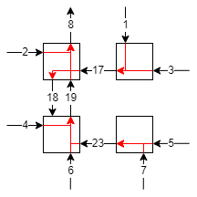
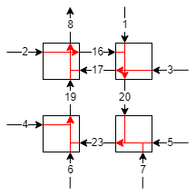
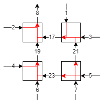
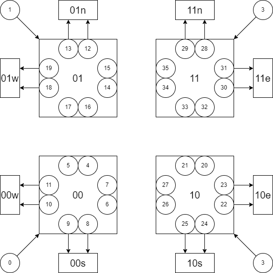

# Verification

## Usage

```
usage: verify.py [-h] [-a] [-b] [-c C] [-d] [-e] [-f F] [-g] graph [graph ...]

positional arguments:
  graph

optional arguments:
  -h, --help  show this help message and exit
  -a          prove liveness property for each graph
  -b          prove deadlock-free property by searching a loop assuming liveness property
  -c C        prove deadlock-free property by verifying the given escape channels assuming liveness property
  -d          prove deadlock-free property by searching a valid escape assuming liveness property
  -e          prove deadlock-free property by searching a loop
  -f F        prove deadlock-free property by verifying the given escape channels
  -g          prove deadlock-free property by searching a valid escape
```

## Channel dependence graph

Each channel is given an interger id starting from 0. The format of the file is as follows:

```
#channels
input channel ids separated by space
output channel ids separated by space
sender receiver [receiver ...]
...
```

### Example
The `xy_routing` directory contains a channel dependence graph of xy routing for each output channel for the following architecture:


For example, if the channel 8 is the output, the communication can happen among the channels as shown in the following figure:


As written in the `xy_routing/out8.txt`, the channel dependence graph for this case can be expressed as follows:

```
24
1 2 3 4 5 6 7
8
1 17
2 8
3 17
4 19
5 23
6 19
7 23
17 8
19 8
23 19
```

## Liveness property

A liveness property is a property that a packet will eventually reach one of the outputs. This property is checked for each of the given graphs. An SMT problem is created to find a path from one of the inputs to a loop or a non-output terminal. If the problem is unsatisfiable, this property is proven. Otherwise, the program shows a set of channels that comprise such a path that violates the property. Note that currently this set may include other channels that do not belong to the problematic path. We could exclude them through iterative solving but not yet implemented.

### Example

The liveness property of the xy routing for the output 8 shown above can be checked by `./verify.py -a xy_routing/out8.txt`. Our program can also take a list of graph files as input and then checks the liveness property for each of them. For example, we can check the liveness property of the xy routing as follows:

```
$ ./verify.py -a xy_routing/*
liveness property verified for xy_routing/out10.txt
liveness property verified for xy_routing/out11.txt
liveness property verified for xy_routing/out12.txt
liveness property verified for xy_routing/out13.txt
liveness property verified for xy_routing/out14.txt
liveness property verified for xy_routing/out15.txt
liveness property verified for xy_routing/out8.txt
liveness property verified for xy_routing/out9.txt
```

We prepared two examples with a bug in `xy_routing_liveness_bug`. In `out8_wrong_terminal.txt`, the channel 17 can send a packet to the channel 18 which is a non-output terminal as shown in the following figure:



Our program returns a path that reaches the channel 18 as follows:

```
$ ./verify.py -a xy_routing_liveness_bug/out8_wrong_terminal.txt
liveness property failed in xy_routing_liveness_bug/out8_wrong_terminal.txt with a path:
1 17 18
```

The other example `out8_loop.txt` has a loop consisting of the channels 16, 20, 23, and 19, where a packet can keep going around forever as shown in the following figure:



Our program returns a set of channels that includes the loop and at least one input channel which connects to the loop as follows:

```
$ ./verify.py -a xy_routing_liveness_bug/out8_loop.txt
liveness property failed in xy_routing_liveness_bug/out8_loop.txt with a path:
5 7 16 19 20 23
```

## Deadlock-free property

A deadlock-free property is a property that a deadlock never happens among multiple packets. We assume each packet can occupy multiple channels at the same time. This property is checked using all of the given graphs, as each packet may have a different destination. Three methods are implemented to prove this property.

The first method simply searches a loop in the union of the given graphs, where the channel dependences in all given graphs are accumulated. As all channels may be occupied by packets each heading for a different destination simultaneously, a loop in the union of the dependence grpahs could cause a deadlock. If there does not exist a loop, the routing is proven to be deadlock-free. Otherwise, the program returns a set of channels that form a loop. However, even if a loop exists, the routing could be deadlock-free because of escape channels.

The second and third methods prove the deadlock-free property under escape channels. The second method takes as input a file in which the escape channels are written separated by space. It proves that there does not exists a loop in an extended channel dependence graph, which consists of the direct dependences (dependences among the escape channels) and the indirect dependences (dependences via non-escape channels). An indirect dependence exists between the escape channels when there exists a sequence of dependence between them in one of the dependecne graphs, which includes non-escape channels. It is assumed that the given escape channels are connected i.e. every useful channel (a channel that can receive a packet) can send a packet directly to one of them in each graph.

The third problem tries to synthesize a valid set of escape channels. It iteratively generates a tentative solution that satisfies a connectivity condition and verifies it by the same problem as the second method. If it is not valid, we obtain a set of escape channels that form a loop of direct or indirect dependences. Then, from the next iteration, we impose a constraint on the synthesis problem such that that set of channels will never be included in the set of escape channels again. This constraint would limit the search space effectively to make our method far more efficient than exhaustive search.

There are two versions of these three methods. One version assumes that each given graph satisfies the liveness property, while the other version does not assume the liveness property but precomputes the maximum number of hops, where a packet is not allowed to revisit the same channel, by a simple breadth-first traversal. This number is used for the formulation of indirect dependence, where we have to duplicate the variables to ignore loops consisting of non-escape channels. The precomputation also checks the existence of reachable non-output terminals during the traversal, and terminates the program if they exist, because non-output terminals anyways cause deadlock. Since the second version uses more complicated formulations, unless the algorithm violates the liveness property, the first version should be used.

### Example

The deadlock-free property of the xy routing can be proven by `./verify.py -b xy_routing/*`. Note that we have to give all resource dependence graphs of the routing to the program for this property.

We added some extra dependences to the xy routing to cause a deadlock in `xy_routing_deadlock_bug`. For the output 8, a dependence from the channel 21 to 17 is added as shown in the following figure:



Besides, for the output 15, a dependence from the channel 18 to 22 is added in a similar way. As this still satisfies the liveness property, we use the first version. The verification using the first method fails pointing out the loop consisting of the channels 21, 17, 18, and 22 as follows:

```
$ ./verify.py -b xy_routing_deadlock_bug/*
deadlock-free property failed with a loop:
0 4 17 18 21 22
```

As mentioned above, the first method, which just detects a loop, does not work for escape-based routing. An example of escape-based routing is in the `escape` directory. It is based on the example in the section 14.3.1 of Dally and Towles. The channel ids are shown in the following figure:



We assign even numbers to "0" channels and odd numbers to "1" channels. The channels 0 to 3 are inputs and each connects to the channels in the node it is directed to. The destinations are denoted by xyd, where x and y are 0 or 1 and d is one of nesw. There are two output channels for each destination.

We again use the first version since this algorihm satisfies the liveness property. The first method finds a loop as follows:

```
./verify.py -b escape/*
deadlock-free property failed with a loop:
0 5 15 26 33
```

This does not mean the routing is not deadlock-free. By designating "0" channels in `escape_0_channels.txt` as escape channels, the second method can prove the deadlock-free property of the routing as follows:

```
$ ./verify.py -c escape_0_channels.txt escape/*
deadlock-free property verified
```

If we use a wrong set of channels as escape channels, such as a set of "1" channels in `escape_1_channels.txt`, the verification fails as follows:

```
./verify.py -c escape_1_channels.txt escape/*
deadlock-free property failed with a loop:
2 5 15 27 33
```

Finally, the third method can find a valid set of escape channels automatically as follows:

```
./verify.py -d escape/*
deadlock-free property verified with escape channels:
4 6 8 11 12 14 16 19 21 23 24 26 28 31 33 34
```

This set contains some "1" channels, especially 21 and 33, but they never forms a loop.

The second version, which does not assume the liveness property, could do the same as follows:

```
./verify.py -e xy_routing_deadlock_bug/*
deadlock-free property failed with a loop:
0 4 17 18 21 22
```

```
./verify.py -e escape/*
deadlock-free property failed with a loop:
0 5 15 26 33
```

```
./verify.py -f escape_0_channels.txt escape/*
deadlock-free property verified
```

```
./verify.py -f escape_1_channels.txt escape/*
deadlock-free property failed with a loop:
2 5 15 27 33
```

```
./verify.py -g escape/*
deadlock-free property verified with escape channels:
4 6 8 11 12 14 16 19 21 23 24 26 28 31 33 34
```

However, if a packet can reach a non-output terminal, meaning obvious deadlock, the program terminates as follows:

```
./verify.py -e xy_routing_liveness_bug/out8_wrong_terminal.txt
packet unreachable
```

`ex.txt` is an example where the second version may be useful. With escape channels `ex_escape.txt`, the first version fails as follows:

```
./verify.py -c ex_escape.txt ex.txt
deadlock-free property failed with a loop:
16
```

This is because the algorithm does not sarisfy the liveness property and the channel 16 connects to a loop of non-escape channels.

On the other hand, the second version can verify the deadlock-free property as follows:

```
./verify.py -f ex_escape.txt ex.txt
deadlock-free property verified
```

Regarding the synthesis, since each channel directly connects to at least one of the output channels, both versions simply return the output channels as follows:

```
./verify.py -d ex.txt
deadlock-free property verified with escape channels:
20 21 22 23
```

```
./verify.py -g ex.txt
deadlock-free property verified with escape channels:
20 21 22 23
```
